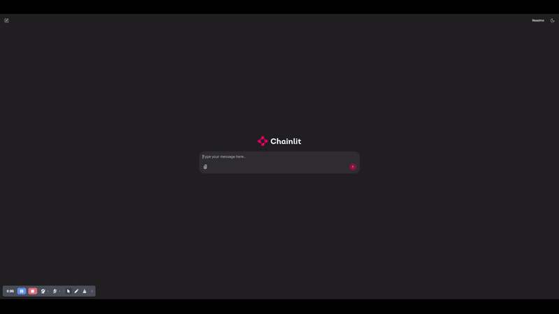

# `Deepseek-r1` on Amazon EC2



Here are the steps to serve the [`deepseek-ai/DeepSeek-R1-Distill-Qwen-32B`](https://huggingface.co/deepseek-ai/DeepSeek-R1-Distill-Qwen-32B) and other models from the `deepseek-r1` family of models on Amazon EC2 using [`vllm`](https://github.com/vllm-project/vllm). vLLM is a fast and easy-to-use library for LLM inference and serving.

>The steps provided below are for the 32B distilled version but apply to other variants as well. To use `deepseek-ai/DeepSeek-R1-Distill-Qwen-32B` for example run this code on a `g6e.12xlarge` Amazon EC2 instance.

1. Create an EC2 instance with the `Deep Learning OSS Nvidia Driver AMI GPU PyTorch` AMI and `g6e.12xlarge` instance type. You can see step by step instructions [here](https://aws-samples.github.io/foundation-model-benchmarking-tool/misc/ec2_instance_creation_steps.html). At the time of this writing the AMI used for `us-east-1` was `ami-067bd563cecc90173`.

1. SSH to your EC2 instance and install docker.

    ```{.bashrc}
    sudo apt-get update
    sudo apt-get install --reinstall docker.io -y
    sudo apt-get install -y docker-compose
    docker compose version
    ```

1. Clone this repo on your EC2 instance.

    ```{.bashrc}
    git clone https://github.com/aarora79/deepseek-r1-ec2
    ```

1. Add your Hugging Face token as an environment variable.
    
    ```{.bashrc}
    export HF_TOKEN=your_hf_token
    ```

1. SSH to your instance and run the following commands. Running the `deploy_model.sh` does the following:

    - Downloads the vllm container from Dockerhub.
    - Start the container, this downloads the model from the Hugging Face hub.
    - Create an endpoint accessible as `localhost:8000/v1/completions` to serve the model.

    ```{.bashrc}
    cd deepseek-r1-ec2
    chmod +x deploy_model.sh
    # the container takes about 10-minutes to start
    # takes two command line arguments, model id and tensor parallel degree
    ./deploy_model.sh deepseek-ai/DeepSeek-R1-Distill-Qwen-32B 4
    ```

1. Wait for 10-minutes, and then verify that the container is running.

    ```{.bashrc}
    docker ps
    ```

    You should see an output similar to the following:

    ```{.bashrc}
    CONTAINER ID   IMAGE                           COMMAND                  CREATED          STATUS          PORTS                                       NAMES
    e21df06d8a7a   vllm/vllm-openai:v0.6.6.post1   "python3 -m vllm.ent…"   10 minutes ago   Up 10 minutes   0.0.0.0:8000->8000/tcp, :::8000->8000/tcp   fmbench_model_container    
    ```

1. Now you are ready to run a `cURL` command to get inference from the model.
    
    Here is an example for text inference.    
 
    ```{.bashrc}
    curl http://localhost:8000/v1/completions \
      -H "Content-Type: application/json" \
      -d '{"model": "deepseek-ai/DeepSeek-R1-Distill-Qwen-32B", "prompt": "What is the theory of quantum gravity?", "temperature": 0.6, "max_tokens": 512}' | jq
    ```

    The above command will generate an output similar to the following:

    ```{.bashrc}
    {
        "id": "cmpl-2be25863e97347f7b6d1999a50409add",
        "object": "text_completion",
        "created": 1738033499,
        "model": "deepseek-ai/DeepSeek-R1-Distill-Qwen-32B",
        "choices": [
            {
            "index": 0,
            "text": " Explain it in simple terms.\n\n</think>\n\nQuantum gravity is a theoretical framework that seeks to reconcile the two major pillars of modern physics: quantum mechanics and general relativity. While quantum mechanics describes the behavior of particles at the smallest scales, general relativity explains the nature of gravity and the large-scale structure of the universe. The challenge is that these two theories are fundamentally incompatible, especially when it comes to understanding phenomena where both quantum effects and strong gravitational fields are significant, such as at the center of black holes or during the early moments of the Big Bang.\n\nThe theory of quantum gravity aims to unify these two perspectives into a single, coherent framework. One of the most promising approaches is string theory, which suggests that particles are not point-like but are instead tiny, vibrating strings. Another approach is loop quantum gravity, which attempts to quantize space itself by describing it in terms of discrete loops or \"spin networks.\" Both of these approaches, and others like them, are still under active research and have yet to be experimentally verified.\n\nIn simple terms, quantum gravity is an attempt to understand how the tiny, strange world of quantum mechanics interacts with the vast, curved spacetime of gravity. It's a quest to find a theory that can describe the universe at its most fundamental level, from the tiniest particles to the largest structures.",
            "logprobs": null,
            "finish_reason": "length",
            "stop_reason": null,
            "prompt_logprobs": null
            }
        ],
        "usage": {
            "prompt_tokens": 9,
            "total_tokens": 521,
            "completion_tokens": 512,
            "prompt_tokens_details": null
        }
    }
    ```

1. You can see traces from the serving container by running the following command:

    ```
    docker logs -f fmbench_model_container
    ```
  
    You should see an output similar to this:

    ```plaintext
    INFO:     Started server process [1]
    INFO:     Waiting for application startup.
    INFO:     Application startup complete.
    INFO:     Uvicorn running on http://0.0.0.0:8000 (Press CTRL+C to quit)
    INFO 01-27 19:04:07 logger.py:37] Received request cmpl-4ad5d844ee8342ebb26e4be1770005ca-0: prompt: 'What is the theory of quantum gravity?', params: SamplingParams(n=1, presence_penalty=0.0, frequency_penalty=0.0, repetition_penalty=1.0, temperature=0.6, top_p=1.0, top_k=-1, min_p=0.0, seed=None, stop=[], stop_token_ids=[], bad_words=[], include_stop_str_in_output=False, ignore_eos=False, max_tokens=512, min_tokens=0, logprobs=None, prompt_logprobs=None, skip_special_tokens=True, spaces_between_special_tokens=True, truncate_prompt_tokens=None, guided_decoding=None), prompt_token_ids: [151646, 3838, 374, 279, 10126, 315, 30128, 23249, 30], lora_request: None, prompt_adapter_request: None.
    INFO 01-27 19:04:07 engine.py:267] Added request cmpl-4ad5d844ee8342ebb26e4be1770005ca-0.
    INFO 01-27 19:04:07 metrics.py:467] Avg prompt throughput: 0.9 tokens/s, Avg generation throughput: 0.1 tokens/s, Running: 1 reqs, Swapped: 0 reqs, Pending: 0 reqs, GPU KV cache usage: 0.0%, CPU KV cache usage: 0.0%.
    INFO 01-27 19:04:12 metrics.py:467] Avg prompt throughput: 0.0 tokens/s, Avg generation throughput: 33.5 tokens/s, Running: 1 reqs, Swapped: 0 reqs, Pending: 0 reqs, GPU KV cache usage: 0.0%, CPU KV cache usage: 0.0%.
    INFO:     172.17.0.1:33604 - "POST /v1/completions HTTP/1.1" 200 OK
    INFO 01-27 19:04:24 metrics.py:467] Avg prompt throughput: 0.0 tokens/s, Avg generation throughput: 6.9 tokens/s, Running: 0 reqs, Swapped: 0 reqs, Pending: 0 reqs, GPU KV cache usage: 0.0%, CPU KV cache usage: 0.0%.
    INFO 01-27 19:04:34 metrics.py:467] Avg prompt throughput: 0.0 tokens/s, Avg generation throughput: 0.0 tokens/s, Running: 0 reqs, Swapped: 0 reqs, Pending: 0 reqs, GPU KV cache usage: 0.0%, CPU KV cache usage: 0.0%.
    ```

1. You can use [`FMBench`](https://aws-samples.github.io/foundation-model-benchmarking-tool/benchmarking_on_ec2.html) for benchmarking performance of this model.

## Instance type and TP degree for different variants of Deepseek-R1

The following table lists the instance types for use with different Deepseek-R1 variants. **Support for the non-distilled model i.e. Deepseek-R1 with 671B parameters is expected soon, stay tuned for updates**.

| **Model** | **Recommented EC2 instance type** | **TP Degree** | **Download** |
| :------------: | :------------: | :------------: | :------------: |
| DeepSeek-R1-Distill-Qwen-1.5B  | `g6e.xlarge` | 1 | [🤗 HuggingFace](https://huggingface.co/deepseek-ai/DeepSeek-R1-Distill-Qwen-1.5B)   |
| DeepSeek-R1-Distill-Qwen-7B  | `g6e.2xlarge` | 1 | [🤗 HuggingFace](https://huggingface.co/deepseek-ai/DeepSeek-R1-Distill-Qwen-7B)   |
| DeepSeek-R1-Distill-Llama-8B  | `g6e.2xlarge` | 1 |  [🤗 HuggingFace](https://huggingface.co/deepseek-ai/DeepSeek-R1-Distill-Llama-8B)   |
| DeepSeek-R1-Distill-Qwen-14B   | `g6e.12xlarge` | 4 |  [🤗 HuggingFace](https://huggingface.co/deepseek-ai/DeepSeek-R1-Distill-Qwen-14B)   |
|DeepSeek-R1-Distill-Qwen-32B  | `g6e.12xlarge` | 4 |  [🤗 HuggingFace](https://huggingface.co/deepseek-ai/DeepSeek-R1-Distill-Qwen-32B)   |
| DeepSeek-R1-Distill-Llama-70B  | `g6e.48xlarge` | 8 | [🤗 HuggingFace](https://huggingface.co/deepseek-ai/DeepSeek-R1-Distill-Llama-70B)   |

## A simple app Conversational AI app

You can run a simple conversation AI app included in this repo, follow steps below.

1. Create a new Python venv and install the dependencies for the application.

    ```{.bashrc}
    curl -LsSf https://astral.sh/uv/install.sh | sh
    uv venv && source .venv/bin/activate && uv pip sync pyproject.toml
    ```

1. Start the `vllm` model server.

    ```{.bashrc}
    # set your HF token
    export HF_TOKEN=your_hf_token
    # change the model id and tensor parallel degree as appropriate
    MODEL_ID=deepseek-ai/DeepSeek-R1-Distill-Qwen-1.5B
    TP_DEGREE=1
    ./deploy_model.sh $MODEL_ID $TP_DEGREE
    ```

1. Start the [`Chainlit`](https://docs.chainlit.io/get-started/overview) app.

    ```{.bashrc}
    chainlit run app.py --port 8001
    ```

1. At this time your browser should open (or you can click on the [http://localhost:8001](http://localhost:8001)) to open it and you should be able to see a browser window with the Chainlit app.

1. Enjoy! Add a GitHub star to this repo if you found it useful 🙏.

